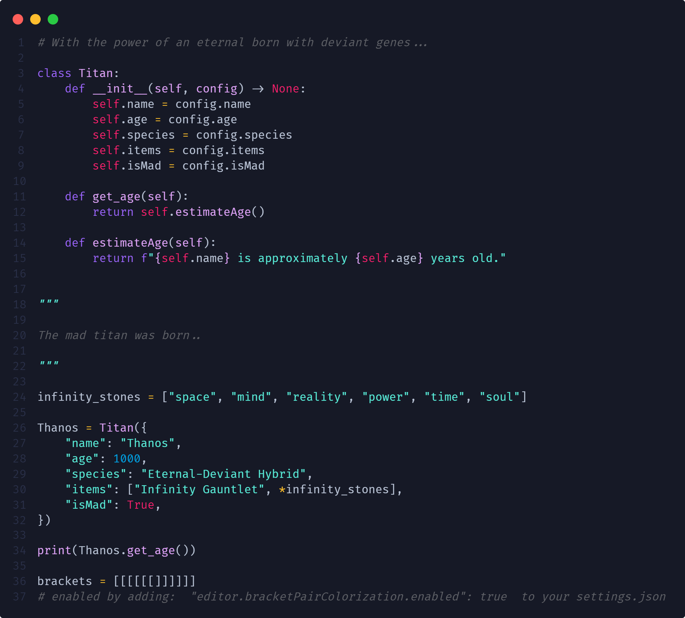

<h1 align="center">
   
  
   
  Thanos theme for <a href="https://code.visualstudio.com/">Visual Studio Code</a>
   
</h1>

  <strong>A theme made by a Titan to conquer the universe</strong>

  <a href="#install">Install</a> •
  <a href="#license">License</a>

  

## Install

All instructions can be found at [INSTALL.md](./INSTALL.md).

## License

[MIT License](./LICENSE.md)

## Override this theme

To quickly test something, you can also override this (or any other) theme in your personal config file. Please follow the guide in the [color theme](https://code.visualstudio.com/api/extension-guides/color-theme) documentation.

## Publish (internal)

> Note: Publishing a new version of this theme is only meant for maintainers.

**Prerequisite**: Please follow this [guide](https://code.visualstudio.com/api/working-with-extensions/publishing-extension) to install and login to `vsce`. Ask an existing maintainer how to get the "Personal Access Token".

1. Merge any PR that is ready to be published into `main`.
2. Perform all the necessary changes following code structure and folder organization.
3. Update [CHANGELOG.md](https://github.com/404-theme/visual-studio-code/blob/master/CHANGELOG.md) + commit the changes.
4. Run `vsce publish [version]`. Follow the [SemVer](https://semver.org) convention and replace `[version]` with one of the following options:
   - `patch` for bug fixes
   - `minor` for improvements
   - `major` for breaking or bigger changes
5. Push the commits and make a [new release](https://github.com/thanos-theme/visual-studio-code/releases/new).
